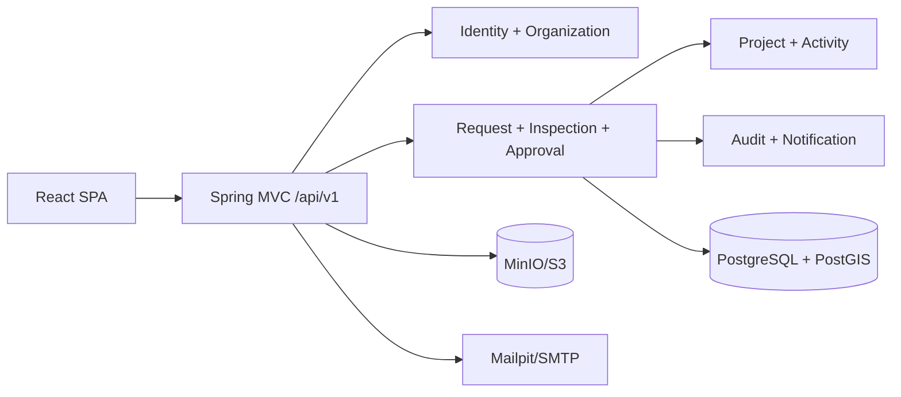
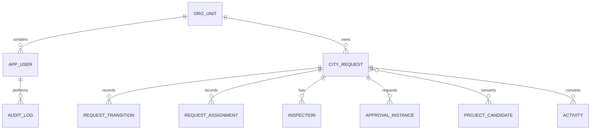

# Mimari

Backend, domain sınırları paketlerle ayrılmış modüler monolittir. Controller'lar DTO kabul eder; iş akışları application servislerinde, kalıcılık infrastructure repository'lerinde bulunur. Modüller repository paylaşmaz. Birim kapsamı `UnitScopeService` üzerinden her sorguya uygulanır.

## ER özeti

